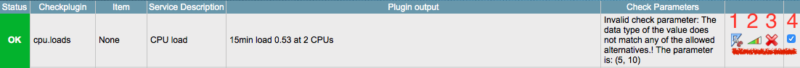

Adding a Linux host
==========
In order to monitor your Linux hosts you must install the check_mk agent and provide a way for the check_mk server to communicate with the agents.

Installation of the check_mk agent can be performed a couple of different ways. Below we cover the most common options:

* Use the agent bakery and "bake" your own agent
* Grab one directly from your existing OMD site(s)

Agent bakery
-----------
The agent bakery allows you to use the same powerful rules based engine from WATO to create agents for you monitored servers. From WATO, access the Monitoring Agents section, click on the Rules button and configure your agents accordingly.

Once you have created the rules to your specifications go back to the Monitoring Agents main page and click on the Bake Agents button.

Depending on your rules you will have one or more agents for one or more operating environments (rpm, deb, msi). You can click on the DEB/RPM/MSI link and download your agent.

Copy that agent over to your monitored server(s) and install according to your operating environment requirements.

Prebuilt package
-----------
All OMD site instances have prebuilt agents available in ~share/check_mk/agents. You will find there the MSI, RPM and DEB agent as well as the pure (script) agents (check_mk_agent.linux).

The RPM/DEB packages will place the check_mk_agent script (for linux/unix) environments in its proper place (/usr/bin). If you download the check_mk_agent.(linux|unix|*) script then you must make this file executable (chmod +x) and also place it in its proper place. You may also want to create the MK_LIBDIR (/usr/lib/check_mk_agent) and MK_CONFDIR (/etc/check_mk) for configuration variables or custom/local plugins (more on these later).

These prebuilt agents are also available via the OMD site URL: http://hostname_or_ip/<omd site name>/check_mk/agents/. At this URL you will also find additional plugins as well as the xinetd.conf configuration file.

Xinetd
-----------
The easiest and quickest way to get up and running is to setup xinetd to ease communications between the check_mk server and the agent. In the prebuilt agents directory you also have an xinetd.conf file. Copy this file over to /etc/xinet.d/check_mk and edit accordingly. Usually you want to configure the only_from variable to allow connections only from your monitoring server.

After copying the xinetd configuration file restart the xinetd server and proceed to testing connectivity by telnetting from your monitoring server to your monitoring client on tcp port 6556.

::

    user@host> telnet xyzhost123 6556
    Trying 10.0.21.47...
    Connected to xyzhost123.
    Escape character is '^]'.
    <<<check_mk>>>
    Version: 1.1.8
    AgentOS: linux
    <<<df>>>
    /dev/sda1     ext3     1008888    223832    733808      24% /
    /dev/sdc1     ext3     1032088    284648    695012      30% /lib/modules
    <<<ps>>>
    init [3]
    /sbin/syslogd
    /sbin/klogd -x
    /usr/sbin/cron
    /sbin/getty 38400 tty2

Adding host to OMD
------------------
After confirming that the agent is accessible you can access WATO, Hosts and click on New host. For our example you can fill out just the hostname and click on Save & go to Services button.

If the hostname is resolvable via DNS you do not need to also specify the IP address however if it is not then the IP address is a required field.

After this step you will be taken to the Services page where you can select and configure the services that check_mk has discovered on your server.

For every service discovered you can choose to:

(1) View and edit parameters
(2) Edit and analyze check parameters
(3) Create a rule to permanently disable discovery of said service
(4) Temporarily ignore the service

* Additional details can be found at the check_mk site https://mathias-kettner.de/checkmk_linuxagent.html
